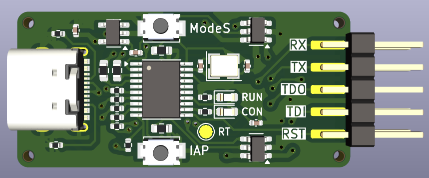

# WCH-LinkE

[WCH-LinkE](https://www.wch-ic.com/products/WCH-Link.html) Clone

## Requirements
* [KiCAD 8.0](https://www.kicad.org/)
* [Fabrication-Toolkit(Optional)](https://github.com/bennymeg/Fabrication-Toolkit)

## Feature
* Change USB Connector to Type-C
* Optimize for ordering [JLCPCB](https://jlcpcb.com)

## LICENSE
[MIT LICENSE](/LICENSE)

## Parts List
You can see parts list from the BOM below.  
[Parts List](/production/bom.csv)

## Schematic and Board image
[Board schematic](WCH-LinkE.pdf)  

## Previous version & Changelog

- v1.1.0(latest)
  - Fix trace width for 3.3V and 5V
  - 3.3V LDO change from AMS1117-3.3 to RT9080-33GJ5
  - Move CH217K to top side
- [v1.0.0](https://github.com/21km43/WCH-LinkE/tree/f1d92fe91850c45036395253008bbfae57f4c86a)
