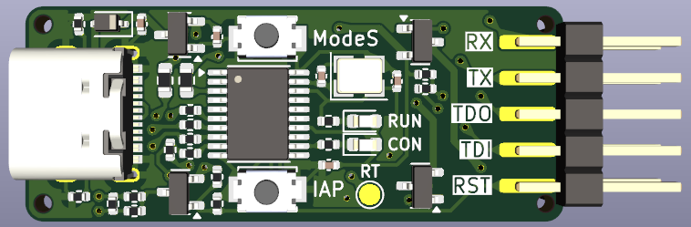

# WCH-LinkE-Mini

This project is compatible with WCH-LinkE.

Boards is optimized for [JLCPCB](https://jlcpcb.com) (includes gerber, bom, cpl, and tooling holes). All components except the CH32V305, USB-C Connector, 3.3V LDO, and Tactile switches are Basic Parts.

## Requirements
* [KiCAD 9.0](https://www.kicad.org/)
* [Fabrication-Toolkit (Optional)](https://github.com/bennymeg/Fabrication-Toolkit)

## LICENSE
[MIT LICENSE](/LICENSE)

## Production files
- [Gerber](/production/WCH-LinkE-Mini_v1.4.0.zip)
- [BOM](/production/bom.csv)
- [Parts List](/production/bom.csv)

## Schematic and Board image
[Board schematic](WCH-LinkE-Mini.pdf)  

IDC Connectors are available here
- [IDC-Header(socket)](https://www.digikey.jp/ja/products/detail/sullins-connector-solutions/SBH11-PBPC-D05-ST-BK/1990062)
- [IDC-Header(header)](https://www.digikey.jp/ja/products/detail/sullins-connector-solutions/SFH11-PBPC-D05-ST-BK/1990087)

